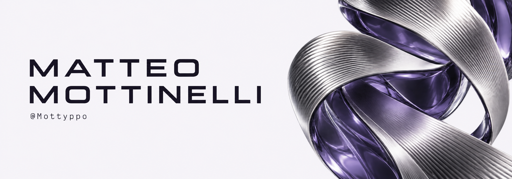

<picture>
  <source media="(prefers-color-scheme: dark)" srcset="assets/banner-editorial-dark.png">
  <source media="(prefers-color-scheme: light)" srcset="assets/banner-editorial-light.png">
  
</picture>

## About me

I’m **proficient in Flutter and Dart**, with a focus on cross-platform application development.

My academic background is in **Computer Science Engineering at the University of Brescia**. I’m also interested in software engineering, computer networks and computer vision.

### Languages & tools

  &nbsp;&nbsp;&nbsp;&nbsp;&nbsp;&nbsp;<picture><source media="(prefers-color-scheme: dark)" srcset="assets/icons/latex-dark.svg"></picture>

Flutter · Dart · Python · Java · PHP · Git · LaTeX

### Contribution activity

<picture>
  <source media="(prefers-color-scheme: dark)" srcset="https://raw.githubusercontent.com/Mottyppo/Mottyppo/output/contribution-snake-dark.svg">
  <source media="(prefers-color-scheme: light)" srcset="https://raw.githubusercontent.com/Mottyppo/Mottyppo/output/contribution-snake.svg">
  
</picture>

---

[Instagram · @matteo.motty](https://www.instagram.com/matteo.motty/) &nbsp; · &nbsp; [LinkedIn](https://www.linkedin.com/in/matteo-mottinelli/)
